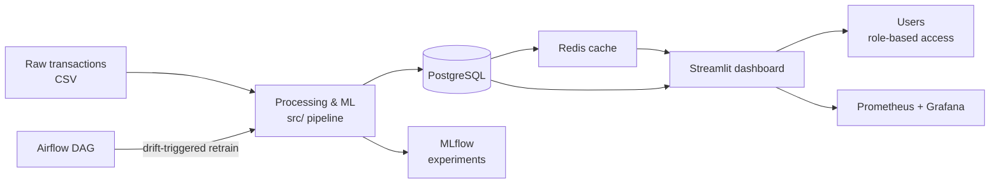

# RetailPulse

**AI-powered retail analytics platform** — turns raw transaction data into customer
intelligence, demand forecasts, and operational alerts through an interactive dashboard
backed by a full MLOps pipeline.


> **Live demo:** https://retail-pulse-ai.streamlit.app &nbsp;·&nbsp; sign in with the [demo accounts](#demo-accounts) below.


<p align="center"><b>📸 <a href="docs/SCREENSHOTS.md">View all screenshots →</a></b></p>

---

## Overview

RetailPulse ingests a year of retail transactions and answers four business questions:

| Question | How RetailPulse answers it |
|----------|----------------------------|
| **Who are my customers?** | RFM scoring + K-Means / DBSCAN segmentation |
| **What will I sell next?** | Prophet + LSTM hybrid demand forecasting |
| **Who is about to leave?** | XGBoost churn model tuned with Optuna |
| **What should I restock?** | EOQ, safety stock & reorder-point optimization |

It also estimates **customer lifetime value** (BG/NBD + Gamma-Gamma), generates
**natural-language insights** (LLM-powered), and runs an **automated retraining
pipeline** that retrains models when data drift is detected.

---

## Key Features

- **Interactive dashboard** — multipage Streamlit app: overview, segmentation, churn,
  forecasting, inventory, CLV, real-time alerts, and an executive command center.
- **Role-based access control** — JWT authentication with four roles; each page enforces
  both login and role permission.
- **AI insights & alerts** — LLM-generated briefings and natural-language Q&A, plus
  threshold-based email alerts for churn, stockout, and revenue drops.
- **Full MLOps loop** — MLflow experiment tracking, Evidently drift detection, and an
  Airflow DAG that retrains models behind an accuracy gate.
- **Production-ready infra** — Dockerized stack, Kubernetes manifests, and
  Prometheus + Grafana monitoring.
- **CI/CD** — automated lint, tests, an accuracy release gate, image build, and deploy.

---

## Architecture



**Data flow:** loaders read through a three-layer cascade — Redis cache →
PostgreSQL (source of truth) → CSV fallback — so the app stays responsive and degrades
gracefully if a backing service is unavailable.

---

## Tech Stack

| Layer | Technologies |
|-------|--------------|
| **ML / Analytics** | Prophet, PyTorch Lightning (LSTM), XGBoost, Optuna, scikit-learn, lifetimes |
| **MLOps** | MLflow, Evidently AI, Apache Airflow |
| **App** | Streamlit, Plotly, JWT auth |
| **Data** | PostgreSQL, Redis |
| **Infra** | Docker Compose, Kubernetes, Prometheus, Grafana |
| **CI/CD** | GitHub Actions, Ruff, pytest |

---

## Project Structure

```
RetailPulse/
├── dashboard/              # Streamlit app
│   ├── app.py              #   entry point — auth gate + navigation
│   ├── pages/              #   14 dashboard pages (overview, churn, forecasting, …)
│   └── utils/              #   auth, data loaders, caching, DB pool
├── src/                    # ML & analytics library
│   ├── feature_engineering.py
│   ├── segmentation.py     #   RFM + K-Means/DBSCAN
│   ├── forecasting.py      #   Prophet training & evaluation
│   ├── lstm_lightning.py   #   PyTorch Lightning LSTM
│   ├── hybrid_forecaster.py#   Prophet + LSTM residual hybrid
│   ├── churn.py            #   XGBoost + Optuna
│   ├── clv.py              #   BG/NBD + Gamma-Gamma lifetime value
│   ├── inventory_optimizer.py
│   ├── drift_detector.py   #   Evidently drift reports
│   └── retrain_pipeline.py #   drift-triggered retrain + accuracy gate
├── scripts/                # Runnable pipeline entry points (run_*.py, db_init.py)
├── dags/                   # Airflow retraining DAG
├── notebooks/              # Exploration & analysis notebooks
├── data/processed/         # Cleaned datasets & model outputs (CSV)
├── models/                 # Trained model artifacts
├── tests/                  # pytest suite (+ load tests)
├── docker/                 # Compose files & service Dockerfiles
├── k8s/                    # Kubernetes manifests
├── monitoring/             # Prometheus config & Grafana dashboards
├── .github/workflows/      # CI (lint + test) and CD (gate + build + deploy)
├── Dockerfile              # Dashboard image
└── requirements.txt        # Dependencies (requirements-prod.txt for runtime)
```

---

## Getting Started

### Prerequisites
- Docker & Docker Compose *(recommended path)*, **or** Python 3.11 for local runs.

### Quick start (Docker — full stack)

```bash
git clone https://github.com/tanmay866/RetailPulse.git
cd RetailPulse
cp .env.example .env          # adjust credentials if needed

docker compose -f docker/docker-compose.yml up -d
```

This starts PostgreSQL, Redis, MLflow, Prometheus, Grafana, seeds the database, and
launches the dashboard. First run seeds the DB (~2 min).

| Service | URL |
|---------|-----|
| Dashboard | http://localhost:8501 |
| MLflow | http://localhost:5000 |
| Grafana | http://localhost:3000 |
| Prometheus | http://localhost:9090 |

### Local development (dashboard only)

```bash
pip install -r requirements.txt
streamlit run dashboard/app.py
```

Without a database the app falls back to the CSVs in `data/processed/`, so it runs
out of the box.

### Demo accounts

| Username | Password | Role |
|----------|----------|------|
| `retailpulse.admin` | `Admin@2026` | Admin (all pages) |
| `retail.analyst` | `Analyst@2026` | Analyst |
| `retail.scientist` | `Science@2026` | Data Scientist |
| `guest` | `Guest@2026` | Viewer (read-only) |

---

## ML Pipeline

Regenerate models and processed data by running the stages in order (from the repo root):

```bash
python -m scripts.run_segmentation     # RFM + clustering
python -m scripts.prepare_forecast     # time-series prep
python -m scripts.run_hybrid           # Prophet + LSTM forecast
python -m scripts.run_churn            # churn model
python -m scripts.run_clv              # lifetime value
python -m scripts.run_inventory        # inventory optimization
python -m scripts.run_validation       # accuracy validation
python -m scripts.run_drift            # drift report

python scripts/db_init.py --flush-redis  # load outputs into PostgreSQL
```

Experiment metrics and artifacts are logged to MLflow throughout.

---

## Testing

```bash
pytest tests/ -v
```

---

## CI/CD

- **CI** (`ci.yml`) — Ruff lint + pytest on every push / PR.
- **CD** (`cd.yml`) — an **accuracy gate** (`run_validation`) must pass before images are
  built and pushed and the app is deployed to Kubernetes. Models that regress below
  `models/baseline_metrics.json` block the release.

---

## Deployment

The hosted demo runs on **Streamlit Community Cloud** with managed backing services:

- **PostgreSQL** — Supabase (connection pooler)
- **Redis** — Upstash (TLS)

Connection strings and secrets (`DATABASE_URL`, `REDIS_URL`, `GROQ_API_KEY`,
`ALERT_EMAIL_*`) are supplied through the platform's secrets manager — never committed.
For self-hosting, the `k8s/` manifests cover the same stack on a cluster.

---

## Datasets

Source data is not committed (size). Download and place in `data/raw/`:

| Dataset | Source |
|---------|--------|
| Online Retail II | https://www.kaggle.com/datasets/mashlyn/online-retail-ii-uci |
| Customer Churn | https://www.kaggle.com/datasets/blastchar/telco-customer-churn |
| Retail Store Inventory | https://www.kaggle.com/datasets/anirudhchauhan/retail-store-inventory-forecasting-dataset |

---

## Acknowledgement

Built as an internship project at **Zidio Development**.
